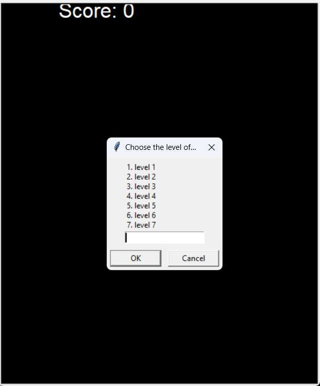
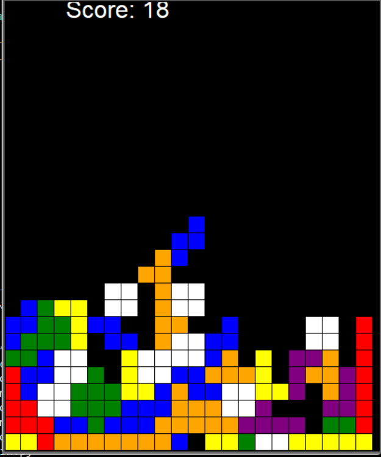
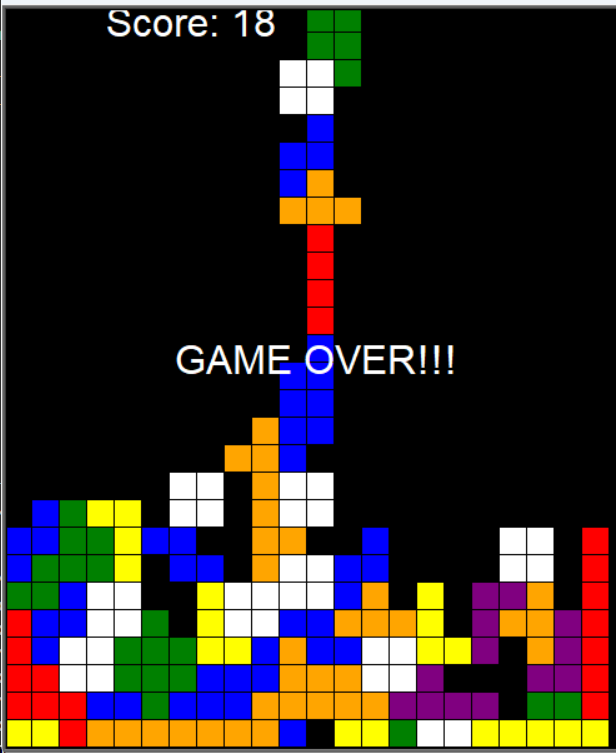

# Tetris Game

Welcome to the Tetris Game! This classic puzzle game will test your skills and challenge your ability to think quickly. Enjoy hours of fun as you strategically place and rotate falling blocks to complete lines and clear the board.

## Screenshots

### Main Menu


Get ready to dive into the world of Tetris! The main menu provides easy navigation to start a new game, view high scores, or adjust game settings.

### Gameplay


Immerse yourself in the addictive gameplay of Tetris. Fit the falling blocks together to create solid lines and watch them disappear. Keep up with the increasing speed as you advance through levels.

### Game Over


Game over? Don't worry! You can always try again to beat your high score. Challenge yourself to improve your skills and reach new heights in the world of Tetris.

## How to Play

1. **Controls:**
   - Use the arrow keys to move the falling block left, right, or down.
   - Press the 'Up' arrow key to rotate the block.

2. **Scoring:**
   - Clear lines to score points.
   - The more lines you clear simultaneously, the higher your score.
   - As you progress, the game speed increases, making it more challenging.

3. **Levels:**
   - Reach higher levels by clearing lines and scoring more points.
   - Each level increases the game speed, testing your reflexes and decision-making.

4. **Game Over:**
   - The game ends when the blocks reach the top of the screen.
   - Challenge yourself to achieve the highest score and climb the leaderboard.

## Installation

To run the Tetris Game executable (.exe) on your local machine or distribute it to other users, follow these steps:

1. **Download the Repository:**
   ```bash
   git clone https://github.com/eziraa/tetris.git
   cd tetris

**Ensure Python is Installed:**

1. Make sure Python is installed on your system. If not, download and install it from Python's official website.
Install Dependencies:

> - If the executable requires additional dependencies, they will be bundled with the distribution. No separate installation is needed.
Run the Executable:

2. Navigate to the project directory and run the executable:
    ```bash
    cd tetris
    dist/main.exe

Enjoy Playing Tetris!

The game should launch, and you can start playing. If you encounter any issues, refer to the troubleshooting section below.
